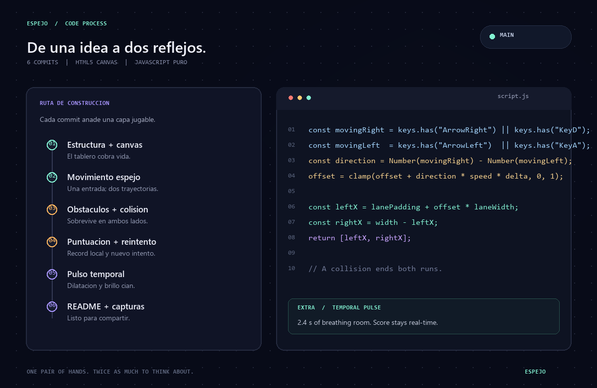
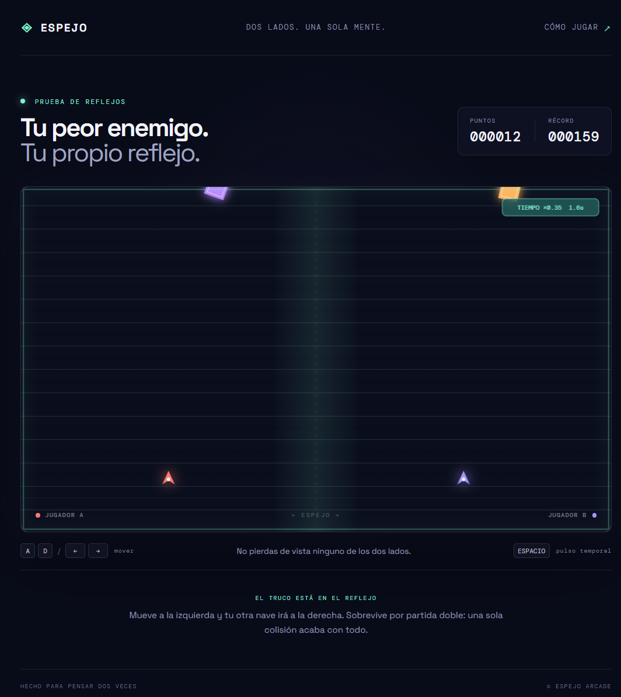

# ESPEJO

**Dos naves. Un solo par de manos. Cero margen para olvidar tu reflejo.**

ESPEJO es un arcade de supervivencia hecho con HTML5 Canvas, CSS y JavaScript puro. Cada movimiento controla dos naves a la vez: una responde a tus manos y la otra se desplaza en sentido contrario. Esquiva los obstáculos en ambos tableros; un choque en cualquiera termina la partida.

## Cómo jugar


| Acción | Teclas |
| --- | --- |
| Iniciar | Botón **Iniciar**, `Enter` o clic en el tablero |
| Reiniciar la partida | Botón **Reiniciar** |
| Mover las dos naves | `A` / `D` o `←` / `→` |
| Activar el pulso temporal | `Espacio` |

**Objetivo:** sobrevive todo lo posible y evita todos los obstáculos. Tu puntuación aumenta con el tiempo de supervivencia; el récord se guarda en el navegador. La partida termina cuando cualquiera de las dos naves choca.

### Jugar desde el celular

En un celular aparecen controles táctiles debajo del tablero: mantén presionadas las flechas para mover las naves y toca **Pulso** para activar la dilatación temporal. También puedes iniciar y reiniciar con sus botones.

Para probarlo en otro dispositivo de la misma red Wi-Fi, inicia el servidor local con `python -m http.server 8000 --bind 0.0.0.0` y abre `http://IP-DE-TU-COMPUTADORA:8000` en el celular. Ambos dispositivos deben estar conectados a la misma red y el firewall debe permitir la conexión. Para que se pueda jugar desde cualquier lugar, publica la carpeta en un servicio de alojamiento estático, como GitHub Pages.

## Las 10 líneas clave del movimiento espejado

La lógica de movimiento se reparte entre `update`, `shipPositions` y `drawShips`. Estas diez líneas muestran cómo las entradas se convierten en dos posiciones reflejadas:

```js
const movingRight = game.keys.has("ArrowRight") || game.keys.has("KeyD");
const movingLeft = game.keys.has("ArrowLeft") || game.keys.has("KeyA");
const direction = Number(movingRight) - Number(movingLeft);
game.offset = clamp(game.offset + direction * movementSpeed * deltaSeconds, 0, 1);
const laneWidth = middle - lanePadding * 2;
const leftX = lanePadding + game.offset * laneWidth;
return [leftX, width - leftX];
const [leftX, rightX] = shipPositions();
drawShip(leftX, "#ff7a72", "#fff1e7");
drawShip(rightX, "#a895ff", "#f0edff");
```

1. Las flechas y `A`/`D` se reconocen como el mismo eje horizontal.
2. Restar los booleanos convierte esas teclas en dirección: izquierda (`-1`), quieto (`0`) o derecha (`1`).
3. `deltaSeconds` hace que la velocidad no dependa de la frecuencia de fotogramas.
4. `clamp` mantiene el control dentro de los límites del tablero.
5. `offset` representa la posición de la nave del lado izquierdo en su carril.
6. `width - leftX` refleja esa coordenada sobre el eje central.
7. `shipPositions()` devuelve ambas coordenadas para que el resto del juego las compruebe.
8. Las naves usan colores distintos, pero comparten una sola entrada.
9. Los obstáculos se generan en cada mitad de forma independiente.
10. La colisión de cualquiera de las dos naves termina la partida.

## Mejora extra: pulso de dilatación temporal

Pulsa **Espacio** para activar durante 2,4 segundos el pulso de dilatación: los obstáculos giran y descienden más despacio, y las siguientes apariciones también se retrasan. La puntuación sigue contando el tiempo real, así que el pulso sirve para ganar una ventana de reacción, no para congelar el récord. Una indicación en el tablero muestra la duración y el enfriamiento de 9 segundos. El borde luminoso y las líneas cian hacen visible cuándo el tiempo está alterado.

Esta habilidad añade una decisión táctica —guardar el pulso para el momento crítico o usarlo para atravesar una sección difícil— y refuerza visualmente la sensación de estar alterando el espejo.

## Estructura del proyecto

```text
Espejo/
├── index.html
├── styles.css
├── script.js
├── README.md
└── assets/
    ├── code-process.png
    └── gameplay.png
```

No se necesitan paquetes, compilación ni dependencias externas. La tipografía se carga desde Google Fonts; si no hay conexión, se utilizan las fuentes de reserva.

## Proceso de desarrollo y screenshots

El proyecto se desarrolló en seis commits incrementales, desde la estructura inicial hasta la documentación. Después se añadieron controles táctiles para facilitar el juego en celulares:

1. `feat: initial commit with project structure and canvas layout`
2. `feat: implement player movement and mirrored movement logic`
3. `feat: add obstacle spawner and collision detection`
4. `feat: implement score counter and game over reset loop`
5. `feat(extra): add temporal inversion pulse and arcade effects`
6. `docs: add complete README.md with process documentation and assets`
7. `feat: add touch controls for mobile devices`

### Proceso de código



### Juego en funcionamiento


